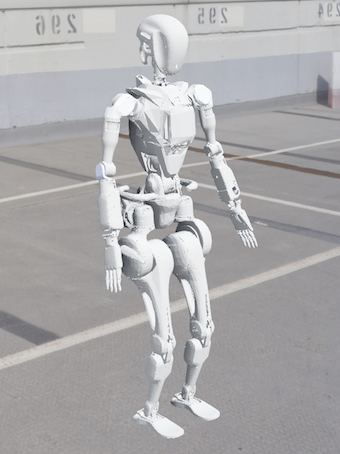

# Wiki-GRx-Webots




[//]: # (![]&#40;./pictures/gr1t1_webots.png&#41;![]&#40;./pictures/gr1t2_webots.png&#41;)

该仓库提供了一个在Webots中测试在NVIDIA的Isaac Gym上训练的RL策略的GRx机器人模型环境。

### 用户指南

1. 安装Webots:
    - 官方网站: https://cyberbotics.com/
    - 文档: https://cyberbotics.com/doc/guide/installation-procedure

2. 安装Anaconda:
    - Anaconda 官方网站: https://www.anaconda.com/products/distribution
    - 下载并安装 Anaconda:
    ```
   bash Anaconda3-2021.11-Linux-x86_64.sh
   ```

3. 创建conda环境:
    - 创建conda环境:
   ```
   conda create -n wiki-grx-webots python=3.11
   conda activate wiki-grx-webots
   ```

4. 安装开发环境:
    - 进入仓库的 `robot-rcs-gr` 文件夹并运行以下命令:
    ```
    pip install -e .
    ```

5. 运行模拟:
    - 在`wiki-grx-webots` conda环境中运行以下命令:
    ```
    webots
    ```

6. 加载世界文件:
    - 在Webots中加载 `wiki-grx-webots/robot-rcs-gr/webots/worlds/gr1t1_simple.wbt` 世界文件以控制 GR1T1 机器人模型。
    - 在Webots中加载 `wiki-grx-webots/robot-rcs-gr/webots/worlds/gr1t2_simple.wbt` 世界文件以控制 GR1T2 机器人模型。

机器人将被加载并在模拟环境中开始行走。

### 不同的Webots世界文件

除了 `gr1t1_simple.wbt` 和 `gr1t2_simple.wbt` 文件，我们还在 `robot-rcs-gr/webots/worlds` 文件夹中提供了 `gr1t1.wbt` 和 `gr1t2.wbt` 文件。

以下是 `gr1t1.wbt` 和 `gr1t2.wbt` 文件与 `gr1t1_simple.wbt` 和 `gr1t2_simple.wbt` 文件之间的一些区别：

- `gr1t1.wbt` 和 `gr1t2.wbt` 文件:
    - GR1T1和GR1T2机器人模型的完整版。
    - 关节位置设置为 0.0 弧度。
- `gr1t1_simple.wbt` 和 `gr1t2_simple.wbt` 文件:
    - GR1T1和GR1T2机器人模型的简化版。
    - **肘部**、**髋关节俯仰**、**膝关节俯仰**和**踝关节俯仰**的关节位置设置为RL默认位置，以获得更好的性能。

### 模型转换

URDF文件不能直接在Webots中使用。您需要将URDF文件转换为PROTO文件。

- https://github.com/cyberbotics/urdf2webots

以下步骤展示了如何将URDF文件转换为PROTO文件：

1. 安装 `urdf2webots` 工具:
    ```
   pip install urdf2webots
   ```

2. 将URDF文件转换为PROTO文件:
    ```
   python -m urdf2webots.importer --input=grx.urdf --output=grx.proto
   ```

---

感谢您对傅里叶智能GRx机器人模型仓库的关注。
希望此资源对您的机器人项目有所帮助！