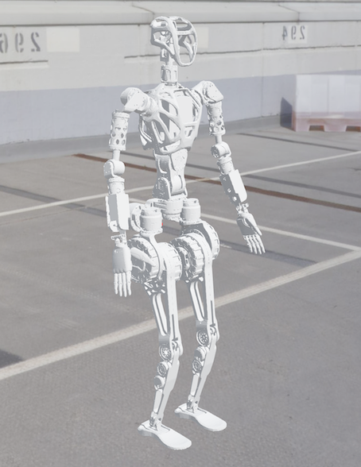

# Wiki-GRx-Webots



This repository provides an environment used to test the RL policy trained in NVIDIA's Isaac Gym on the GRx robot model in Webots.

### User Guide

1. Install Webots:
    - Official Website: https://cyberbotics.com/
    - Documents: https://cyberbotics.com/doc/guide/installation-procedure

2. Install Ananconda:
    - Anaconda Official Website: https://www.anaconda.com/products/distribution
    - Download and install Anaconda:
    ```
   bash Anaconda3-2021.11-Linux-x86_64.sh
   ```

3. Create a conda environment:
    - Create a conda environment:
   ```
   conda create -n wiki-grx-webots python=3.11
   conda activate wiki-grx-webots
   ```

4. Install development environment:
    - Enter the repository `robot-rcs-gr` folder and run the following command:
    ```
    pip install -e .
    ```

5. Run the simulation:
    - Run the simulation (in the `wiki-grx-webots` conda environment) by running the following command:
    ```
    webots
    ```

6. Load the world file:
    - Load the world file `wiki-grx-webots/robot-rcs-gr/webots/worlds/gr1t1_simple.wbt` in Webots.

The robot will be loaded and start walking in the simulation environment.

---

Thank you for your interest in the Fourier Intelligence GRx Robot Model Repository.
We hope you find this resource helpful in your robotics projects!